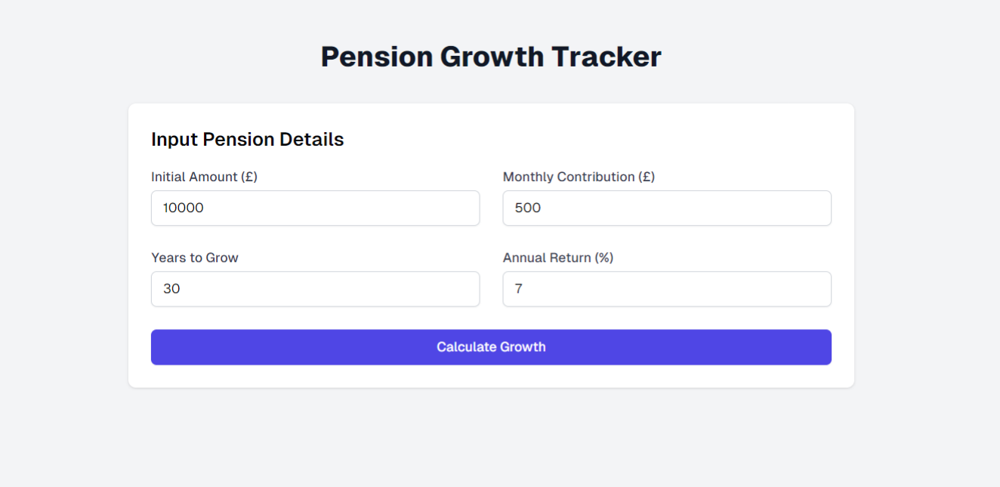

# Pension-Growth-Tracker-ui

A react component that creates a website for tracking pension payment growth

## Project Highlights:

1. A form to input pension details:

   - Initial amount
   - Monthly contribution
   - Years to grow
   - Annual return rate

2. A "Calculate Growth" button that triggers the pension growth calculation.

3. A line chart that visualizes the pension growth over time.

4. A table that displays the year-by-year breakdown of the pension balance.

5. Responsive design using Tailwind CSS classes for optimal viewing on different screen sizes.

## Getting Started:
To use this component, you'll need to install the required dependencies:

`npm install react-chartjs-2 chart.js`

This component uses Tailwind CSS for styling, so make sure your project is set up with Tailwind CSS. The design is responsive and should work well on both desktop and mobile devices.

## Future Improvements:

You can further customize this component by adding more features such as:

1. Ability to factor in inflation

2. Multiple scenarios comparison

3. Downloadable reports

4. Integration with real pension data APIs